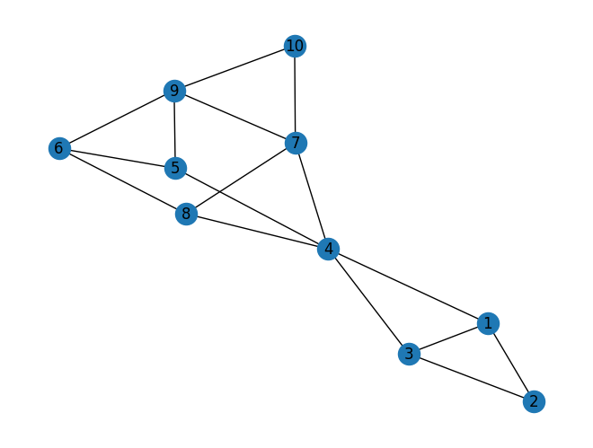
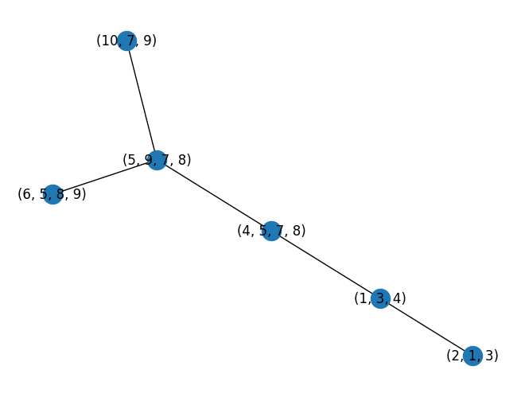

# TreeDecomposition
### Sections
- Demonstration
- Code Explanation/Intuition
- Resources

## Demonstration
Import all the classes
```python
from Graph import Graph
from Tree import Tree
from Bag import Bag
from TreeDecomposition import TreeDecomposition
from EliminationOrder import DynamicMinimumDegree # StaticMinimumDegree, RandomEliminationOrder
import copy
```
Construct a graph
```python
graph = Graph()
# graph.addNode(NodeID)
graph.addNode(1)
graph.addNode(2)
graph.addNode(3)
# graph.connectNodes(ID1, ID2, Distance)
graph.connectNodes(1, 2, 1)
graph.connectNodes(1, 3, 1)
...
```
Draw a graph
```python
graph.draw()
```
<div style="display: flex;">
  
</div>

Compute an Elimination order
```python
eliminationOrder = DynamicMinimumDegree(copy.deepcopy(graph))

print(eliminationOrder)
```
[ 2, 1, 3, 10, 4, 6, 5, 7, 8, 9 ]

Compute a Tree Decomposition
```python
tree = TreeDecomposition(copy.deepcopy(graph), eliminationOrder, fully=False) # default = False, this does not remove subset nodes

tree.draw()
```

<div style="display: flex;">
  
</div>

```python
tree = TreeDecomposition(copy.deepcopy(graph), eliminationOrder, fully=True) # require a graph to be all connected

tree.draw()
```
<div style="display: flex;">
  
</div>

```python
print(tree.getTreeWidth())
```
3

Get the root node
```python
print(tree.root.toString()) # .root return the node object
```
( 5, 9, 7, 8 )

## Code Explanation/Intuition
### Class `Node`
A class representing a node. Keep track of its own connections.
#### Important Methods
- `connect(node)`: add the node to the dict of the current node's connections.
- `disconnect(node)`: remove the node from the dict of the current node's connections.
- `getDegree()`: return the number of nodes that this node is connects to.
- `getConnections()`: return a list of all the node IDs that this node connects to.

### Class `Graph`
A class representing all the nodes. Allows nodes to interact with each other.
#### Important Methods
- `connectAll([list of nodes])`: form a clique (fully connected component) among nodes in the list.
- `getLowestDegree()`: get the node with the lowest number of connections in the graph. This is done by popping the min heap for the tuple, checking if the degree of that node in the tuple is up to date (O(1) through accessing the key in the dictionary, and accessing the node's degree property). If it is up to date, return the node with the ID in the tuple; if not, keep popping the heap.
- `getNode`, `addNode`, `removeNode`, `connectNodes`, and `disconnectNodes` should be trivial. Every time `connectNodes` and `removeNodes` are called, a tuple of updated number of degree and ID is added to a min heap.

### Class `Bag`
A class inherited from the class `node` representing a node of a tree. Save a subgraph that forms that bag as well as keep track of its parent. 
#### Important Methods
- `getMember()`: return a set of original nodes in the graph in this bag.
- `isSubsetOf(bag)`: return a boolean whether the current bag is the subset of the bag argument (bag1 is a subset of bag2 iff every original node in bag1 is in bag2).
- Because it is inherited from the node class, it should also have every method that the class node has.

### Class `Tree`
A class representing the tree that is a result of tree decomposition. This tree will be constructed in the tree decomposition function.
#### Important Methods
- `addNode(ID, processNode, processNodeID)`: This is to add a new bag to the graph. It takes in a node object as one of the arguments, as we want to save it as one of the properties and also to update the tree treewidth.

### `EliminationOrder`
A file containing different functions to generate elimination orders.
- `RandomEliminationOrder`: return a list of all node IDs in random order.
- `DynamicMinimumDegree`: return a list of all node IDs in ascending order of degree at each time step. This means the first item is the node with the lowest degree at the start, the second item is the node with the lowest degree after we process the first node, the third item is the node with the lowest degree after we process the first and the second node, and so on.

### `TreeDecomposition`
A file containing `TreeDecomposition` function and its helpers.

Pseudo Code
```
1. Initialize T as an empty tree
2. For each node v in the elimination order π:
    a. Form a bag B_v containing v and all of its neighbors in G
    b. Add B_v to the tree T
    c. Connect all neighbors of v to form a clique in G
    d. Remove v from G

3. For each bag B in T:
    a. Identify the node u in B that appears earliest in the elimination order π
    b. Let B_u be the bag formed when processing node u
    c. Set B_u as the parent of B in the tree T

4. Select a random node in T and traverse up its parent chain
   until reaching a node with no parent; set it as the root of T

5. Traverse T and remove any bag that is a subset of another bag in the tree
```

- `removeSubsetNode(Tree)`: Loop through all the bags in the tree and call `contractSubsetNode` on it.
- `contractSubsetNode(tree: Tree, bag: Bag)`: This function recursively contracts the node if one is the subset of the other and vice versa.

## Additional Resources
- Computational Topology (Jeff Erickson) - Treewidth
    - https://jeffe.cs.illinois.edu/teaching/comptop/2009/notes/treewidth.pdf
    - This is the main paper of this project. We follow the definition and the algorithm from this paper.
- An Experimental Study of the Treewidth of
Real-World Graph Data (Maniu et al. 2019)
    - https://arxiv.org/pdf/1901.06862 
    - https://github.com/smaniu/treewidth/
    - We compare our implementation result with the algorithm from this paper.
- Metaheuristic Algorithms and Tree Decomposition (Hammerl et al. 2012)
    - https://www.dbai.tuwien.ac.at/staff/musliu/TreeDecompChap.pdf
    - Another paper that help me understand tree decomposition more deeply.
- A Theorist’s Toolkit (Ryan O’Donnell) - Treewidth
    - https://www.cs.cmu.edu/~odonnell/toolkit13/lecture17.pdf
    - This along with the paper above were helpful in helping me understand the tree decomposition algorithm.
- Real Datasets for Spatial Databases: Road Networks and Points of Interest (Li. 2005)
    - https://users.cs.utah.edu/~lifeifei/SpatialDataset.htm
    - This is the main dataset that we use to test our algorithm.
- Some additional road networks that we can use to test our algorithm.
    - https://networkrepository.com/road.php
    - https://www.diag.uniroma1.it/challenge9/download.shtml