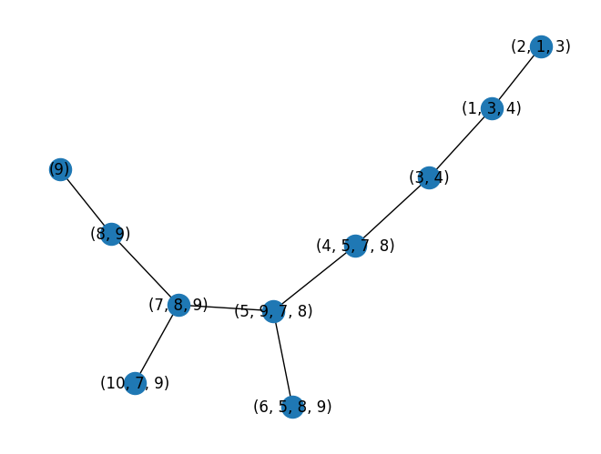

# TreeDecomposition
### Sections
- Demonstration
- Code Intuition
- Resources
- Detailed Code Explanation

## Demonstration
Import all the classes
```python
from Graph import Graph
from Tree import Tree
from Bag import Bag
from TreeDecomposition import TreeDecomposition
from EliminationOrder import DynamicMinimumDegree # StaticMinimumDegree, RandomEliminationOrder
import copy
```
Construct a graph
```python
graph = Graph()
# graph.addNode(NodeID)
graph.addNode(1)
graph.addNode(2)
graph.addNode(3)
# graph.connectNodes(ID1, ID2, Distance)
graph.connectNodes(1, 2, 1)
graph.connectNodes(1, 3, 1)
...
```
Draw a graph
```python
graph.draw()
```
<div style="display: flex;">
  
</div>

Compute an Elimination order
```python
eliminationOrder = DynamicMinimumDegree(copy.deepcopy(graph))

print(eliminationOrder)
```
[ 2, 1, 3, 10, 4, 6, 5, 7, 8, 9 ]

Compute a Tree Decomposition
```python
tree = TreeDecomposition(copy.deepcopy(graph), eliminationOrder, fully=False) # default = False, this does not remove subset nodes

tree.draw()
```

<div style="display: flex;">
  
</div>

```python
tree = TreeDecomposition(copy.deepcopy(graph), eliminationOrder, fully=True) # require a graph to be all connected

tree.draw()
```
<div style="display: flex;">
  
</div>

```python
print(tree.getTreeWidth())
```
3

Get the root node
```python
print(tree.root.toString()) # .root return the node object
```
( 5, 9, 7, 8 )

## Code Intuition
- 
## Additional Resources
- 
## Detailed Code Explanation
### `Node` Class
A class representing a node. Keep track of its own connections.
#### Important Methods
- `connect(node)`: add the node to the dict of the current node's connections.
- `disconnect(node)`: remove the node from the dict of the current node's connections.
- `getDegree()`: return the number of nodes that this node is connects to.
- `getConnections()`: return a list of all the node IDs that this node connects to.

### `Graph` Class
A class representing all the nodes. Allows nodes to interact with each other.
#### Important Methods
- `connectAll([list of nodes])`: form a clique (fully connected component) among nodes in the list.
- `getLowestDegree()`: get the node with the lowest number of connections in the graph. This is done by popping the min heap for the tuple, checking if the degree of that node in the tuple is up to date (O(1) through accessing the key in the dictionary, and accessing the node's degree property). If it is up to date, return the node with the ID in the tuple; if not, keep popping the heap.
- `getNode`, `addNode`, `removeNode`, `connectNodes`, and `disconnectNodes` should be trivial. Every time `connectNodes` and `removeNodes` are called, a tuple of updated number of degree and ID is added to a min heap.

### `Bag` Class
A class inherited from the class `node` representing a node of a tree. Save a subgraph that forms that bag as well as keep track of its parent. 
#### Important Methods
- `getMember()`: return a set of original nodes in the graph in this bag.
- `isSubsetOf(bag)`: return a boolean whether the current bag is the subset of the bag argument (bag1 is a subset of bag2 iff every original node in bag1 is in bag2).
- Because it is inherited from the node class, it should also have every method that the class node has.

### `Tree` Class
A class representing the tree that is a result of tree decomposition. This tree will be constructed in the tree decomposition function.
#### Important Methods
- `addNode(ID, processNode, processNodeID)`: This is to add a new bag to the graph. It takes in a node object as one of the arguments, as we want to save it as one of the properties and also to update the tree treewidth.